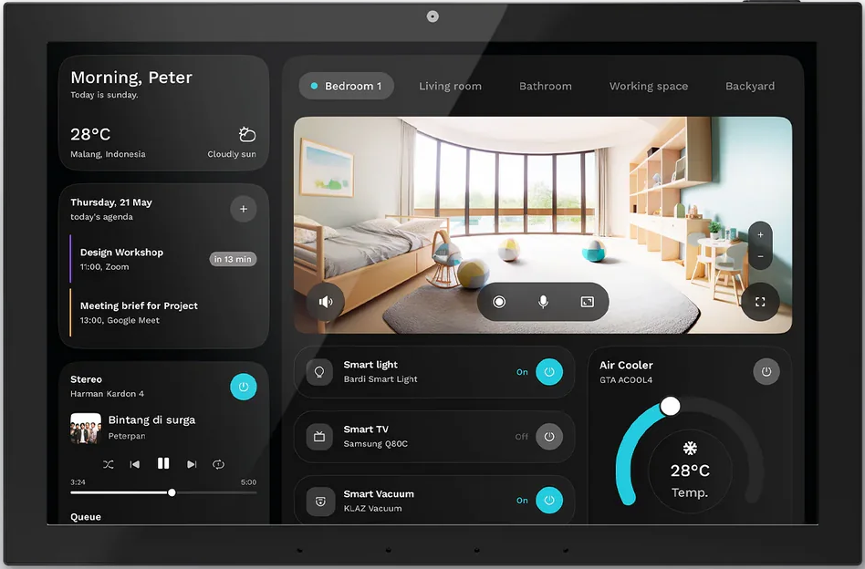

## 🚀 Connect Haade Panel s504 ( elc SMT ) to HomeAssistant via MQTT connect

**SMT101 MQTT Control App** is a custom Flutter application designed to run on an Android wall-mounted tablet (SMT 101 model).  

**===>** [**Smart Home Panel SMT 101**](https://s.click.aliexpress.com/e/_omyM8Ge) **<===**

[](https://s.click.aliexpress.com/e/_omyM8Ge)

**===>** [**Smart Home Panel SMT 101**](https://s.click.aliexpress.com/e/_omyM8Ge) **<===**

It enables complete remote control and monitoring of the tablet’s built-in hardware (RGB LEDs, relays, I/O pins, temperature, humidity, light sensor) and the screen — all integrated with your Home Assistant via MQTT.

---

## 📱 Main Features

- ✅ Connects to any MQTT broker (supports Home Assistant MQTT Discovery)
- ✅ Controls RGB LEDs using native JNI (`libjnielc.so`)
- ✅ Controls physical relays via GPIO (`libgpio_Control.so`)
- ✅ Monitors digital inputs and GPIO states
- ✅ Reads temperature, humidity, and light sensor data
- ✅ Publishes all sensor states automatically over MQTT
- ✅ Controls tablet screen: turn on/off, adjust brightness, wake on ambient light
- ✅ Shows local notifications for important MQTT events
- ✅ Multi-language support with `.arb` translation files

**===>** [**Smart Home Panel SMT 101**](https://s.click.aliexpress.com/e/_omyM8Ge) **<===**

## ⚙️ Requirements

- SMT101 Android tablet (or compatible device with the same GPIO)
- Android 13 or newer
- Flutter SDK `>= 3.10`
- Dart `>= 3.1`
- `libjnielc.so` and `libgpio_Control.so` native libraries
- MQTT broker (e.g. Mosquitto or Home Assistant MQTT Add-on)
- Visual Studio Code or Android Studio

**===>** [**Smart Home Panel SMT 101**](https://s.click.aliexpress.com/e/_omyM8Ge) **<===**

## 🚀 Quick Start

### 1️⃣ Clone the Repository

```bash
git clone https://github.com/YOUR_USERNAME/smt101_mqtt_app.git
cd smt101_mqtt_app
```

# METHOD 1 - Install flutter on docker

## 🚀 flutter into docker

docker build . -t flutter_docker
docker run -i -p 8080:9000 -td flutter_docker
access http://localhost:8080

# METHOD 2 - Install flutter + dependances on PC


### 2️⃣ Install Dependencies

```bash
flutter pub get
```

### 3️⃣ Connect Your SMT101 Tablet

Connect via USB or ensure it’s visible to adb.

```bash
flutter device
```

**connect to tablet:**

```bash
adb tcpip 5555
adb connect your-ip:5555
adb root
adb shell
pm disable com.android.gallery3d/com.android.gallery3d.app.PackagesMonitor
pm list receivers -d | grep gallery
```

### 4️⃣ Run in Debug Mode
```bash
flutter run
```

### 5️⃣ Build a Release APK

```bash
flutter build apk --release
```

**The signed APK will be located here:**

```bash
build/app/outputs/flutter-apk/app-release.apk
```
**===>** [**Smart Home Panel SMT 101**](https://s.click.aliexpress.com/e/_omyM8Ge) **<===**

## 🧪 Debugging & Troubleshooting

**if you want enable put:**

```
pm enable com.android.gallery3d/com.android.gallery3d.app.PackagesMonitor
adb shell pm list receivers | grep gallery3d
```

**read unactivate composant:**

```bash
adb shell pm list packages -d
```

✅ **Logs:**
Use flutter logs to see real-time debug messages.

✅ **Native Libraries:**
Make sure libjnielc.so and libgpio_Control.so are in:

```swift
android/app/src/main/jniLibs/armeabi-v7a/
```

✅ Permissions:
Grant the app permissions to access sensors, GPIO, and wake locks if needed.

✅ MQTT Connectivity:
Check broker credentials and verify topics using MQTT Explorer or Home Assistant MQTT integration.

**===>** [**Smart Home Panel SMT 101**](https://s.click.aliexpress.com/e/_omyM8Ge) **<===**

## 📡 MQTT Topics

| Topic                       | Purpose                       |
| --------------------------- | ----------------------------- |
| `smt101/led/set`            | Set RGB LED color             |
| `smt101/led/state`          | Report current RGB LED state  |
| `smt101/relay1/set`         | Turn relay 1 ON/OFF           |
| `smt101/relay1/state`       | Report relay 1 state          |
| `smt101/relay2/set`         | Turn relay 2 ON/OFF           |
| `smt101/relay2/state`       | Report relay 2 state          |
| `smt101/input1/state`       | Digital input 1 state         |
| `smt101/input2/state`       | Digital input 2 state         |
| `smt101/sensor/temperature` | Temperature reading           |
| `smt101/sensor/humidity`    | Humidity reading              |
| `smt101/sensor/light`       | Light level reading           |
| `smt101/screen/on`          | Wake up or turn ON the screen |
| `smt101/screen/off`         | Turn OFF the screen           |

All topics are automatically published using Home Assistant MQTT Discovery format for easy integration.

## 🧩 Project Structure

lib/
 ├── main.dart          # Entry point
 ├── services/
 │    ├── mqtt_service.dart   # Core MQTT client & reconnect logic
 │    ├── led_service.dart    # RGB LED control via JNI
 │    ├── relay_service.dart  # Relay I/O control via JNI
 │    ├── gpio_service.dart   # Digital input/output handling
 │    ├── sensor_service.dart # Temperature, humidity, light sensor
 │    ├── screen_service.dart # Screen ON/OFF and brightness control
 │    └── notification.dart   # Local notification helper
 ├── l10n/              # `.arb` translation files
 │    ├── app_en.arb
 │    ├── app_fr.arb
 │    └── ...
 ├── pages/             # Flutter UI pages
 └── widgets/           # Reusable UI widgets

## 🌍 How to Add a New Translation

1️⃣ Copy the default **app_en.arb**

```bash
cp lib/l10n/app_en.arb lib/l10n/app_es.arb
```

**===>** [**Smart Home Panel SMT 101**](https://s.click.aliexpress.com/e/_omyM8Ge) **<===**

## 📞 Microphone & Phone Permissions

This app requests:
- `RECORD_AUDIO` — to use the built-in microphone.
- `READ_PHONE_STATE` and `CALL_PHONE` — to read phone status and initiate calls if needed.

These are declared in `AndroidManifest.xml` and requested dynamically at runtime using the [`permission_handler`](https://pub.dev/packages/permission_handler) package.

## 📄 License
This project is licensed under the MIT License.

Permission is hereby granted, free of charge, to any person obtaining a copy of this software and associated documentation files (the “Software”), to deal in the Software without restriction, including without limitation the rights to use, copy, modify, merge, publish, distribute, sublicense, and/or sell copies of the Software, and to permit persons to whom the Software is furnished to do so, subject to the following conditions:

The above copyright notice and this permission notice shall be included in all copies or substantial portions of the Software.

THE SOFTWARE IS PROVIDED “AS IS”, WITHOUT WARRANTY OF ANY KIND, EXPRESS OR IMPLIED, INCLUDING BUT NOT LIMITED TO THE WARRANTIES OF MERCHANTABILITY, FITNESS FOR A PARTICULAR PURPOSE AND NONINFRINGEMENT. IN NO EVENT SHALL THE AUTHORS OR COPYRIGHT HOLDERS BE LIABLE FOR ANY CLAIM, DAMAGES OR OTHER LIABILITY, WHETHER IN AN ACTION OF CONTRACT, TORT OR OTHERWISE, ARISING FROM, OUT OF OR IN CONNECTION WITH THE SOFTWARE OR THE USE OR OTHER DEALINGS IN THE SOFTWARE.

## 👨‍💻 Maintainer
Developed by HAADE
Feel free to open issues, contribute or submit pull requests!

**===>** [**Smart Home Panel SMT 101**](https://s.click.aliexpress.com/e/_omyM8Ge) **<===**

